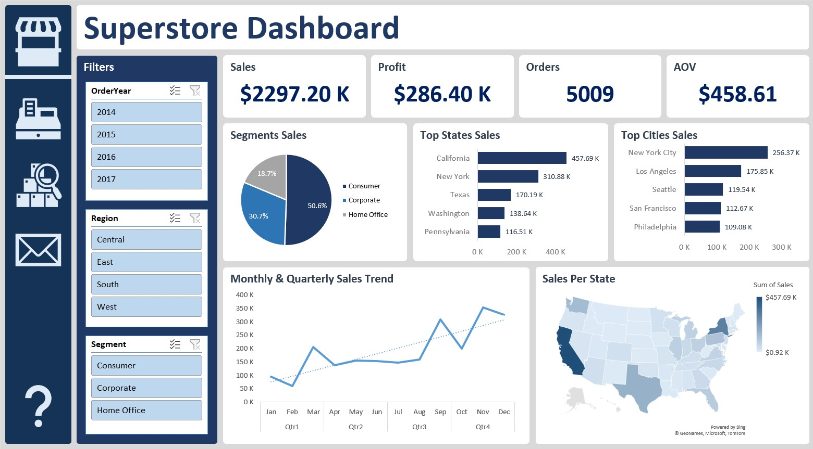
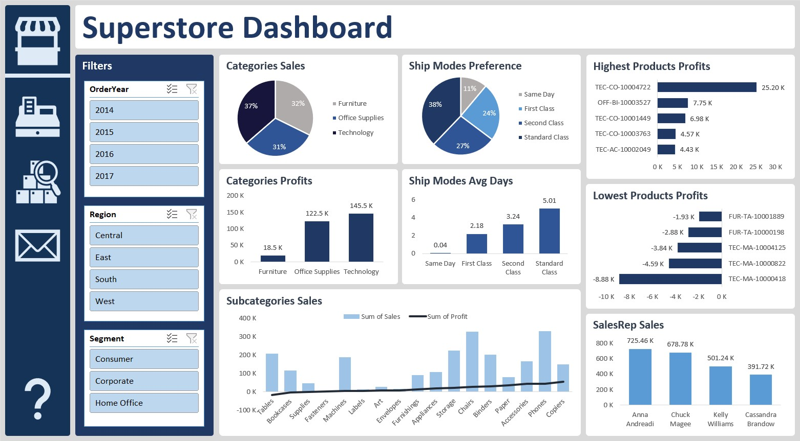
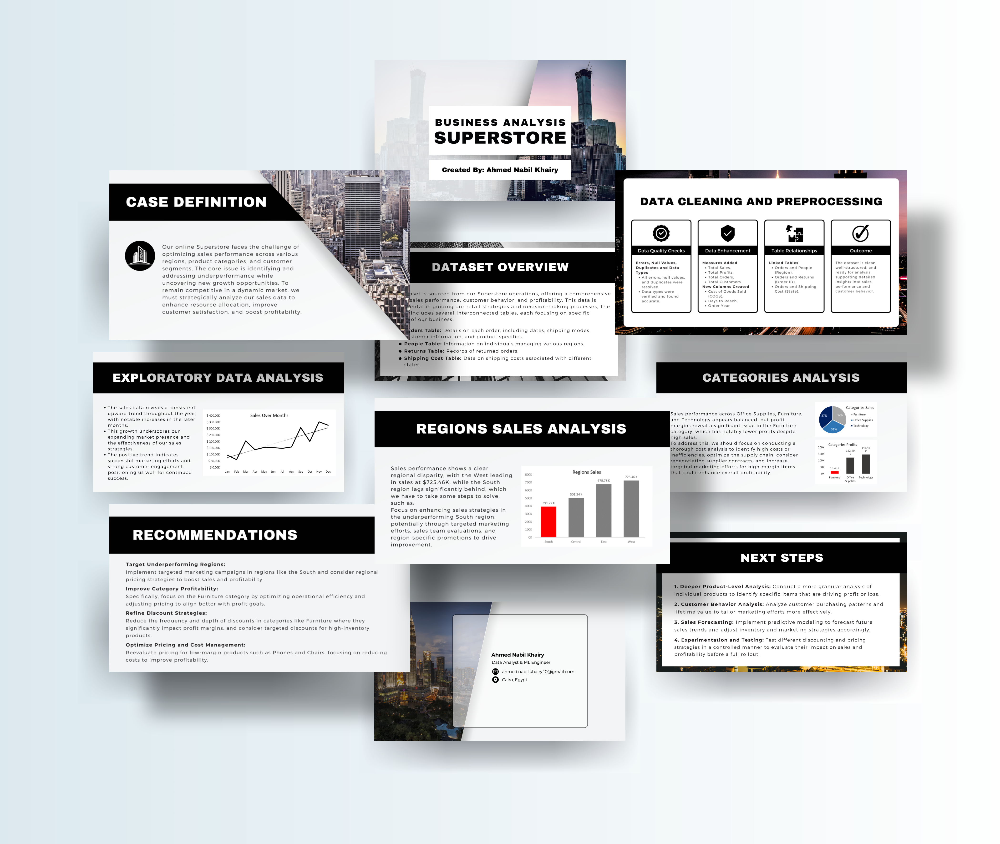

# Superstore Dashboard and Report

This repository contains a **Superstore Dashboard** and a comprehensive **Report** designed to provide in-depth insights into sales trends, profit margins, customer preferences, and regional performance. 
The objective is to empower data-driven decision-making in retail management by identifying key drivers of success and areas for improvement, along with actionable recommendations for optimizing sales strategies, improving customer satisfaction, and enhancing overall business performance.

## Dataset Overview
The dataset is sourced from the Superstore operations, offering insights into sales performance, customer behavior, and profitability. Key components include:
- **Orders Table**: Details on each order, including dates, shipping modes, customer information, and product specifics.
- **People Table**: Information on individuals managing various regions.
- **Returns Table**: Records of returned orders.
- **Shipping Cost Table**: Data on shipping costs associated with different states.
  
## Dashboard 📊

We have 2 dashboards:
1. **Overview Dashboard**: Provides a high-level overview of key performance indicators.
2. **Detailed Insights Dashboard**: Offers insights into categories, subcategories, products, and shipping methods.

### Key Insights:
- **Sales Trend**: Consistent growth in sales over the months.
- **Region Sales**: The West tops the regions in sales, while the South lags behind.
- **Customer Segments**: The Consumer segment leads, contributing over 50% of total sales.
- **Shipping Modes**: “Same Day” is the fastest method, while “Standard Class” is the most frequently used.
- **Top States & Cities**: California and New York shine, with New York City and Los Angeles leading in city sales.
- **Categories & Subcategories**: Technology excels in both sales and profits, with Phones and Copiers as the top performers. Tables and Bookcases are the lowest performers.

### Dashboard Features
- **Interactive Filter Bar**: A filter bar allows users to control (Order Year, Region, Segment), making it easier to refine the data. Users can apply multiple filters simultaneously for a more detailed analysis.

### Dashboard Preview
- **Overall Dashboard**:
  

- **Detailed Insights Dashboard**:
  


## Presentaion Report 📝

This detailed **Report** offers a deeper analysis and actionable recommendations based on the data. It identifies both positive trends and areas of concern while offering solutions and outlining next steps for further analysis.

### Report Contents:
1. **Case Definition**: Describes the business context and problem.
2. **Project Goal**: Outlines the objectives of the analysis.
3. **Dataset Overview**: Summary of the dataset used.
4. **Data Cleaning**: Process of cleaning and preparing the data for analysis.
5. **Data Analysis**: Key trends, patterns, and insights identified from the data.
6. **Key Findings**: Highlights of the most important discoveries.
7. **Conclusion**: Summary of findings and overall results.
8. **Recommendations**: Actionable steps to address identified challenges.
- Additionally, the report includes **Next Steps**, which suggest further analysis opportunities to deepen insights into the data.

### Sample of the Report:


## Tools
- **Visualization**: Excel
- **Presentation Report**: Powerpoint
- **Additional Technologies**: Power Query, Power Pivot, and DAX for enhanced data analysis and visualizations.

## Resources
- **Superstore Dataset**

## Repository Structure

```bash
superstore-dashboard-and-report/
│
├── data/
│   ├── superstore_dataset.xlsx
│   └── shipping_cost_data.xlsx    
│
├── images/
│   ├── overall_dashboard.jpg   
│   ├── detailed_dashboard.jpg
│   └── report_sample.png  # Image showing a part of the report
│
├── superstore_report.pdf  # Full report
├── superstore_work.xlsx    # Excel file containing the dashboard
└── README.md
